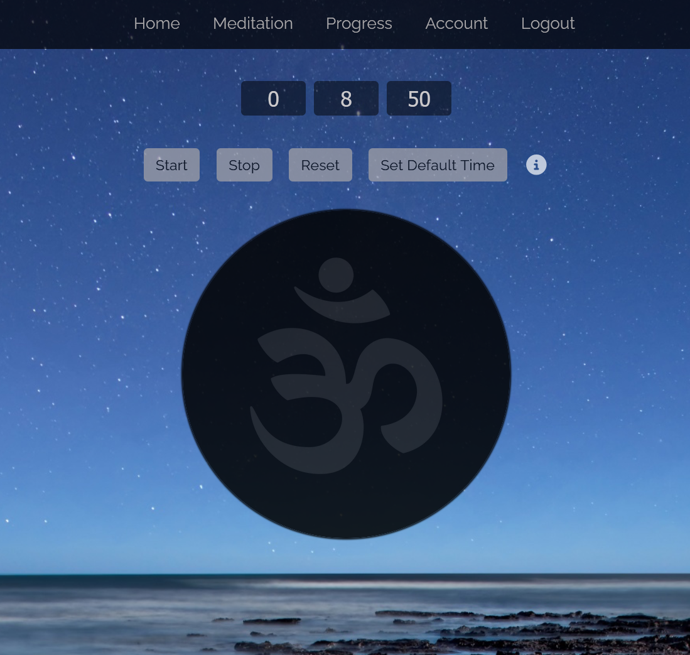
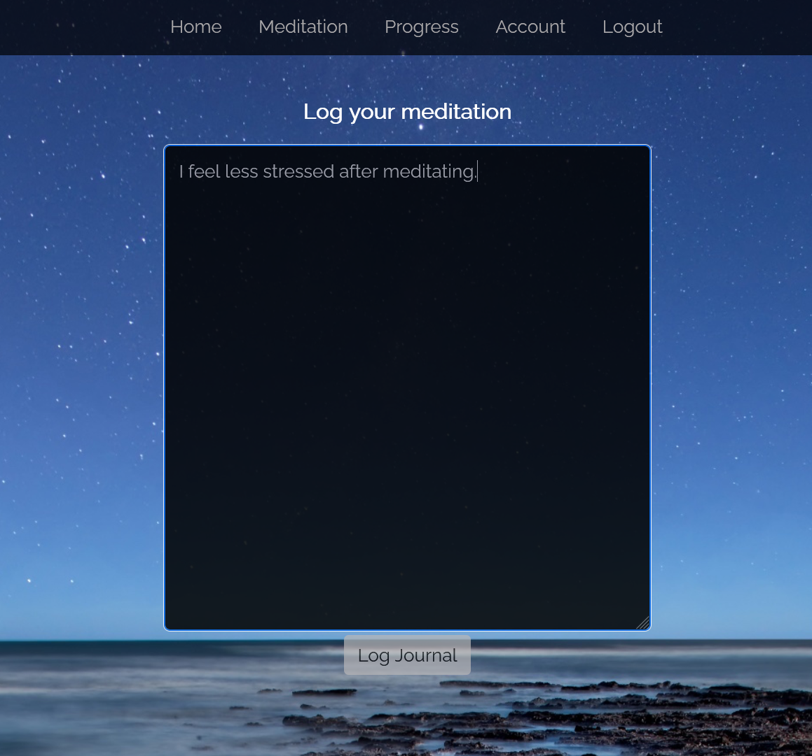
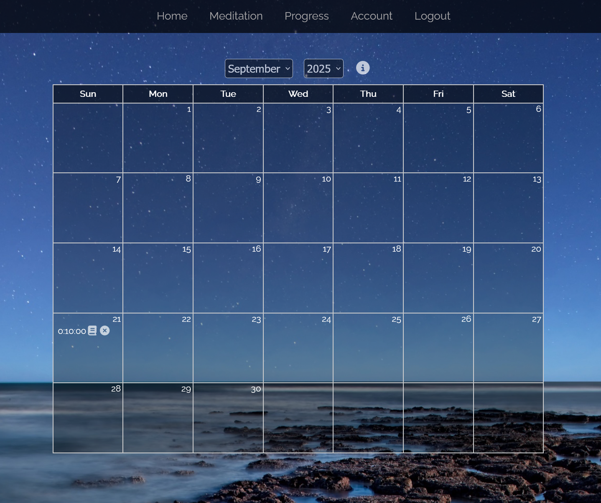

# Meditation App

Currently online at: https://meditate-app-js.herokuapp.com/

## Overview

This Meditation App is a web application for users to record meditation sessions, journal their thoughts, and track progress over time. Users can meditate using a built-in timer, and after each session, they are prompted to make a journal entry about their experience or thoughts. These journal entries and meditation records are stored for viewing in a calendar format, allowing users to see how often and how long they meditate and review past journal entries.

To get started, register an account and then log in.

## Meditation

The `Meditation` section of the site allows a user to record a timed meditation session, and the user can adjust the default time for meditation sessions.

After the meditation session has finished, the user will be prompted to journal any thoughts or reflections about the meditation session.

## Progress

The `Progress` section displays a calendar view of meditation sessions, where each session is displayed with the amount of time meditated.  Users have the option to view and edit their journal entries, or delete sessions.

## Account

The `Account` section allows users to change their email address or password.

## Running the Application Locally

To run locally, make sure Docker is installed, then run `docker build -t meditate-app .`, then `docker run -p 8080:8080 --env-file ./server/.env meditate-app`.  Then navigate to `http://localhost:8080` to run the app.
